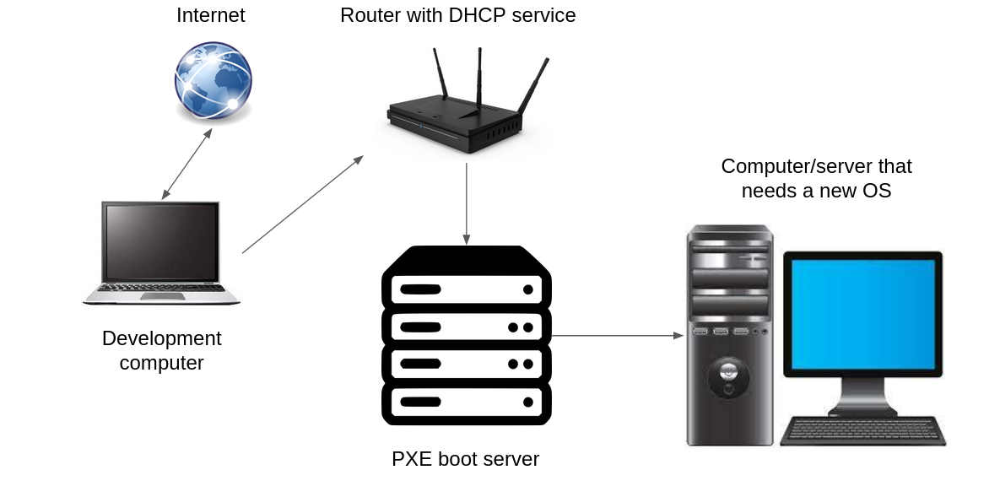

# Ansible PXE Setup
This is a very simple, to a large extent hardcoded, playbook that sets up a PXE server which installs ubuntu server 21.04.  
Keep in mind that if you don't intend to install an Ubuntu distribution you will have to change a whole lot of things in the playbook.

## Topology
The test setup was very hacky, it worked but it wasn't possible to connect the computer-to-be-installed or the pxe server to the internet, hence I needed to use my internet connected laptop to serve the ubuntu iso to the pxe server. The setup looked like this:  

Because `dnsmasq` is normally used as DHCP service and this setup required a router which ran a DHCP service, there is a workaround for this in the playbook. I haven't tested it without this workaround but hopefully it's as simple as removing the workaround parts in the playbook to make it work on a setup that is not reliant on a router in the same way. 

## Hardcoded paths
### `configuration-files/default`
The `configuration-files/default` file contains two things in particular to keep in mind. The first is that it assumes there is a local webserver running at `192.168.10.100:80`, I set this up with a simple python server like this: `sudo python -m http.server 80`. The webserver needs to serve a directory containing the ISO that is going to be installed on your new PXE booting machine. The simplest approach is to download the ISO to your desired directory and then start the python webserver in this directory.  
This last part introduces the second point to keep in mind; you need to manually download the server image to your development machine to be able to serve it. If you don't download the `ubuntu-21.04-live-server-amd64.iso` image you obviously need to change the ISO name in the `default` file too. 

### `configuration-files/dnsmasq.conf`
There is only one thing to keep in mind regarding the `dnsmasq.conf` file, the dhcp range is set to `192.168.10.0`, change this as necessary to fit your own setup.

### `configuration-files/grub.cfg`
Here you need to change `menuentry 'Ubuntu 21.04'` towards the bottom of the file, not because it won't work if you don't but because it'd just be confusing if it says "Ubuntu 21.04" but you're actually installing something else.

### `configuration-files/pxe.conf`
In this file you only need to change `dhcp-range=ens4,192.168.10.100,192.168.10.200` to whatever is appropriate for your setup.  

### `configuration-files/resolved.conf`
I don't think there's anything that needs to be changed in this file.

### `hosts`
Set the IP to whatever your PXE-server-to-be has.

### `main.yml`
We have now reached the big chonky `main.yml` file.  
1. `{{ username }}`: This is defined in the `vars/username.yml` file. Change accordingly  
2. Change the ISO name in the `Check if ISO has been downloaded` task if you're not using the default ISO  
3. Change the URL in the `Download ubuntu ISO` task to whatever you are using  
4. Change the ISO name in the `Copy vmlinuz and initrd from downloaded ubuntu iso` task to something appropriate  

Now follows a very Ubuntu 21.04 specific part of the setup, the playbook is hardcoded to download a couple of `.deb` files that come from Ubuntu 21.04, hence if you are using a different Ubuntu version, or something completely different, you are going to have adapt this part accordingly.  
After the `.deb` download and operations part follows a copy-files-from-the-ansible-host part. This is probably not necessary to do anything with. 

## Conclusion
The intention of this playbook is not to be a universally useful and plug-and-play solution. I made it to be able to test PXE booting and to my great surprise and delight I managed to get it to work.  
So there you have it, a janky playbook that works under very specific circumstances. If I ever need this in some kind of generalizable setting I may make it more universal and simplify the setup process with a `vars.yml` file or similar, but for now this is it.